## 计划 2022.5.27 - 2022.6.27 （每天）

### 2 小时 3 道题， 平均一道题 40min

- 并不是连续刷题
- 前 10min 理解题意, 理解题意很重要，把握住题目的细节，做到不看题目心中知道题目表达的含义
- 20min 分析过程，最后 10min coding
- 额外再花点时间记录刷题过程 —— 简单总结，记录对这题的理解，分析时间复杂度、空间复杂度

### 刷题不能乱刷，每个 topic 都要有涉略，每个类型都要有

- 新手：
  - 数组
  - 字符串
  - 链表
  - 数学
  - 栈
  - 哈希表
  - 树
  - 图
- 进阶
  - 排序
  - 二分
  - 递归
  - 双指针
  - 贪心
  - 深度优先
  - 滑动窗口
  - 动态规划

### 用一个 EXCEL 表记录刷题记录

### 程序 = 数据结构 + 算法

1. 数据结构也比较重要

### 必备的类型有：


### 学习的一个顺序

算法考题中会涉及到很多的知识点，纯算法的，数据结构的，数学的，脑筋急转弯的...
我们的目的不去去完成所有的算法题，只掌握基础的  
算法 + 数据结构  
后面有基础，对刷题有感觉了再去做高频的且自己不会的

### 先看左神算法课的笔记，看不懂的地方再去搜视频

### 语言 JavaScript 和 java

### 时间复杂度

- 常数操作数量
  - \+ - \* / % 数组寻址
- 等差数列 0 + 1 + 2 + 3 + 4 + ... + n-1

### 评价一个算法的好坏就是看它的 Time/Space 复杂度

- 单从时间复杂度来看，我们就是要追求时间复杂度低的算法，简单来说就是减少一个算法中数据操作量，常数操作的减少意义不大，要减少指标量级的。

### 对数器

1. 有一个想要验证的方法 a
2. 实现一个绝对正确但并不怎么好的方法 b
3. 实现一个随机生成随机数组的方法
4. 测试大量数据比对方法 a 和方法 b
5. 如果有错记录出错时状态
6. 如果大量数据比对都没有没问题，方法 a 就正确

### 基础的纯算法的有

1. 扫描线
2. BFS
3. DFS
4. 二分搜索
5. 分治法
6. 单调栈
7. 单调队列
8. 滑动窗口
9. 十大排序

- 冒泡排序
- 选择排序
- 插入排序
- 归并排序
- 随机快排
- 堆排序
- 桶排序
- 计数排序
- 基数排序

### 递归 ---- 分治思想，大问题化小

- 剖析递归时间复杂度
  - master 公式：
    - 
    - a 是大问题递归次数之间的关系（不是子问题一共发生次数，a 是一次大问题化子问题化了几次），N/b 是子问题的数据量规模，后面加的是除去递归之后剩下操作的一个时间复杂度
  - master 公式适用范围是划分的子问题规模是一样的，不一样就不能套用 maste 公式
- 例子
  - 求最大值
  - 归并排序(O(N\*logN))
    - 左边排序、右边排序
    - 再把左右两边 merge
  - 小和问题：在一个数组中，每一个数左边比当前数小的数累加起来，叫做这个数组的小和。求一个数组的小和。
    - 例[1, 3, 4, 2, 5]
    - 1 + 1 + 3 + 1 + 1 + 3 + 4 + 2 = 16
    - merge 的时候，找到右侧数组中 比 cur 数大的次数 t，形成 t \* cur 小和
    - 每次 merge 的时候，就会逐渐找出小和
    - 用分治的思想去解决小和问题，就可以在一次 merge 的时候批量找出右边比当前数大的次数
      - res += arr[p1] < arr[p2] ? (R - p2 + 1) \* arr[p1] : 0;
      - 大问题是在数组中找左边比当前数小的数相加
        - 子问题变成 在左边当前数，找右边数中比当前数大的数有几个
        - 分治思想分治很简单，分治的过程只是将大问题无限化小，化成只有左和有两部分
        - 在最后的 merge 才是问题的实际解决过程
  - 逆序对问题：一个数组中，左边的数如果比右边的数大，则这两个数构成一个逆序对，请打印所有逆序对
    - 分治之后判断右边数种比当前数小
  - 归并排序快的原因是它组内的排序行为没有被浪费，在最后 merge 利用外排的方式把之前有序的排序利用起来。不像冒泡，选择、插入排序那样，它们慢的原因就是在于有重复的比较行为。

### 二分法

- 二分法 while 的写法

1.  ```Java
    while(l < r) {
      ...
    }
    return sortedArr[L] == target;
    ```
2.  ```Java
    while(l <= r) {
      ...
    }
    return false;
    ```
3.  二分法还要注意 mid:

- (L+ R)/2 这种写法会有溢出的可能性
- 推荐写法是 L + (R - L)/2)这种写法保险, 还可以写成 L + ((R-L)>>1)

4. 二分法适用范围

- 数据集是有序的
- 数据集在有限范围内是有序的（比如求 局部最小值，只有数据在局部是有序的就可以用二分法）

### 快排

- 荷兰国旗问题
- 经典快排的思想跟荷兰国旗问题差不多，拿最后一个数 X 划分，左边小于等于 X，右边大于 X
  - 经典快排每次只处理一个数
  - 经典快排和数据状态有关：
    - 如果数组有序，快排每次就只处理了一个数，左边是小于 X，右边没有，这样一次是 O(N),要循环 N 次，快排就退变成 O(N²)
    - 如果数组每次划分比较好，中间数永远在中间，那就是 O(N\*logN)
  - 优化：添加随机，替换最后一个位置数 X，快排就变成长期期望是 O(N\*logN)的算法
  - 随机快排是三个 O(N \* logN)算法中最快的算法，当最高指数项一致时，比较常数项；快排常数操作小
  - 随机快排的额外空间复杂度长期期望是 O(logN)，空间浪费在记录 P 的边界， 每次 partition 都会记录 p

### 递归 系统栈的代价是比较大的，工程上不允许出现递归

- 系统压栈会把递归所有的信息都记录下来，这个代价是比较大的
- 而且系统栈在递归了一定范围是会报错
- 递归函数一定是要改成非递归

### 绕开源数据数据状况最常用的两种操作：

1. 随机打乱数据状况
2. hashMap

### 堆排序

- 堆结构(优先级队列) —— 完全二叉树
  - 数组结构 2\*i + 1 就可以对应出一个二叉树，完全以数值之间的关系补全二叉树
- 大根堆（任何一棵子树的 root 都是最大值）
  - i 找它的父节点（(i - 1)>>1），判断大小交换
  - 每一步都形成大根堆，直至换完整个数组
  - 交换的代价与完全二叉树的高度有关，O(logN)
  - 建立大根堆的时间是 O(N) = log1 + log2 + log3 + ... + logN-1 ——heapInsert
  - 堆向下跑 —— heapify
- 小根堆（任何一棵子树的 root 都是最小值）
- 堆的调整（不管是加一个数，减一个数）都是 logN 的

- 堆排序
  - 1. 形成一个大根堆
  - 2. 每次堆顶和堆低交换，heapSize-1
  - 3. 再经历一个 heapify 的过程形成一个长度减一的大根堆，再循环步骤 2、3
  - 每次 2 后最大的数就被放到了末位，这样再经过 3 的循环，逐渐排完整个数组

### 视频 2 最后的补充问题

- 给定一个数组，求如果排序之后，相邻两数的最大差值，要求时间复杂度 O(N)，且不能用非基于比较的排序。

### 版本号排序问题

```JS
function transToNumArr(arr) {
  for (let i = 0; i < arr.length; i++) {
    arr[i] = arr[i].split(".");
  }
}

function arrToPersionStr(arr) {
  return arr.map((item) => item.toString().replace(/,/g, "."));
}

function persionSort(arr) {
  if (!arr || arr.length < 2) return arr;

  transToNumArr(arr);

  //   let maxL = arr[0].length;
  //   for (let i = 1; i < arr.length; i++) {
  //     if (arr[i].length > maxL) {
  //       maxL = arr[i].length;
  //     }
  //   }

  for (let i = 1, len = arr.length; i < len; i++) {
    let index = i;
    let isWhile = true;
    while (isWhile && index - 1 >= 0) {
      for (let j = 0, maxL = Math.min(arr[index].length, arr[index - 1].length); j < maxL; j++) {
        if (arr[index][j] < arr[index - 1][j]) {
          swap(arr, index);
          break;
        }
        if (arr[index][j] > arr[index - 1][j]) {
          isWhile = false;
          break;
        }
      }
      index--;
    }
  }

  return arrToPersionStr(arr);
}

function swap(arr, j) {
  let temp = arr[j];
  arr[j] = arr[j - 1];
  arr[j - 1] = temp;
}

function randomTest(maxArrLen, maxStrLen) {
  const len = randomFun(maxArrLen); // [1, 6] 的随机长度
  const res = [];
  for (let i = 0; i < len; i++) {
    let str = "";
    for (let j = 0, strLen = randomFun(maxStrLen); j < strLen; j++) {
      str += Math.floor(Math.random() * 9);
      if (j !== strLen - 1) {
        str += ".";
      }
    }
    res.push(str);
  }
  return res;
}

function randomFun(num) {
  return Math.ceil(Math.random() * num);
}

const testArr = randomTest(6, 5);
console.log("init:", testArr);
const final = persionSort(testArr);
// 为什么放在函数里却是不行, 因为你个笨蛋没有返回，map产生了一个新对象
console.log("sort:", final);
```

这个题这里我是用了插入排序的思想去比较版本号大小，这样的时间复杂度如果不看每一个版本号内部的长度，
那就是插入排序的时间复杂度 O(n²)。

### 近期安排

纵有星辰大海想去追逐，也有当下要把握的行程，千里之行始于脚下。总是望着山海那边，看不到眼前的坑坑洼洼，这样怎么才能安全抵达？
收获 算法，为我的行程披荆斩棘。算法很难也很简单，日常工作中也很少刻意去用它，但他却时时刻刻出现在你的代码世界里。
结合目前我的实际情况来看，我应该先去容易的地方收获多一点的算法，才能在算法的国度里领略到更多的风景，结识到更多朋友。
JavaScript 和 Java 是我闯荡的技能，我会优先选择偏 JS 方面去游历算法国度。
我打算先去结交排序算法，认识十大排序算法高手。先逐一去拜访各个排序算法，跟着他们学习成为好伙伴，掌握他们的独门秘籍。
认识完排序之后，我打算去到数据结构城，去结交数据结构的每一位小伙伴，拉他们入伙，熟知他们每个人身上的长处。

随着旅行，在排序的小镇里认识了冒泡排序、插入排序、shell 排序三位神奇的小伙伴，他们都有独特的排序技能，可以打乱的序列表排列整齐。冒泡排序的排序方式像金鱼吐泡泡一样，大的泡泡慢慢的浮出水面;插入排序总是拿最新的记录和之前的做比较将新记录插到它正确的位置;shell 排序优化了插入排序，每次在增量 gap 中进行插入排序直到 gap 为 1,极大的优化了重复次数。

### 十大排序 总结

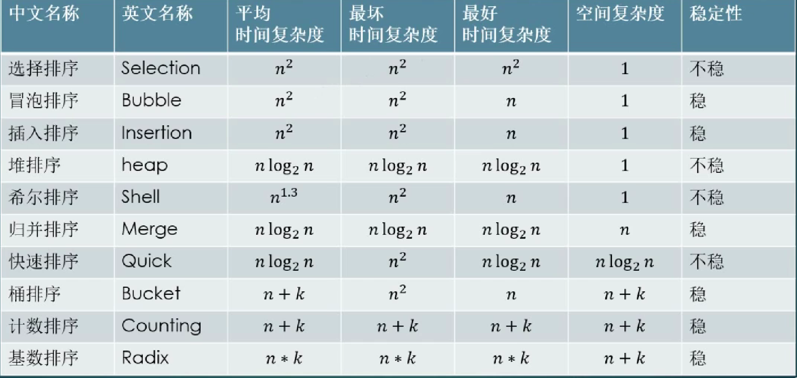

一. 插入排序
核心思想：将一个记录插入到已经排好序的有序表中，从而得到一个新的，记录数加 1 的有序表。

1. 插入排序

- 核心：第一个记录作参考值，每趟都比较当前和它前一个数比较，如果比前一个数大就交换，直至比完当前数左边所有的记录。
- 代码：

```JS
function InsertSort(arr) {
  if (!arr || arr.length < 2) {
    return arr;
  }

  for (let current = 1, len = arr.length; current < len; current++) {
    while (current - 1 >= 0 && arr[current - 1] > arr[current]) {
      swap(arr, current - 1, current);
      current--;
    }
  }
  return arr;
}

function InsertSort2(arr) {
  if (!arr || arr.length < 2) {
    return arr;
  }

  for (let current = 1, len = arr.length; current < len; current++) {
    for (let pre = current - 1; pre >= 0 && arr[pre] > arr[pre + 1]; pre--) {
      swap(arr, pre, pre + 1);
    }
  }
  return arr;
}
```

- 时间复杂度 O(N²)、空间复杂度 O(1)

2. 折半插入
3. 2-路插入排序
4. 希尔排序

- 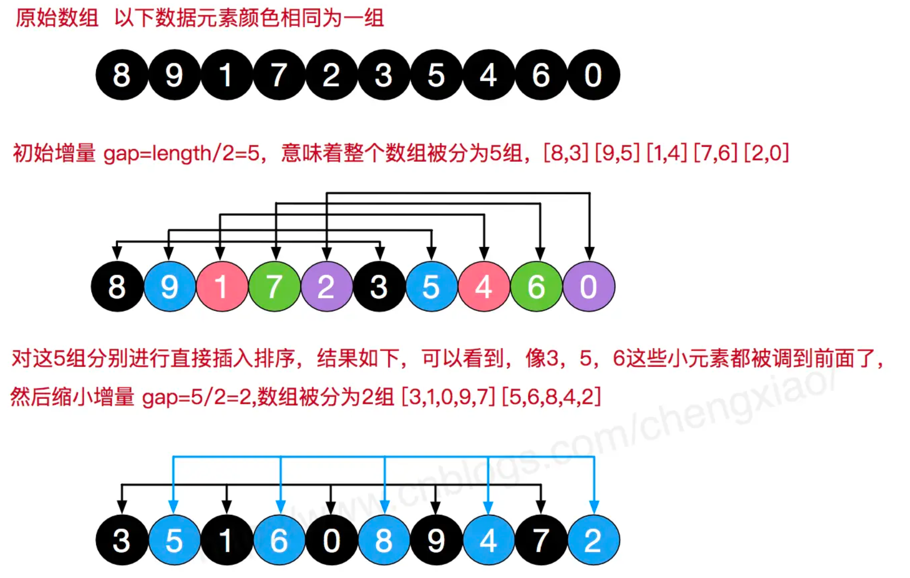
- 在普通插入排序的基础上，增加了一个增量的概念，把原始数组按增量划分，每次在增量中进行插入排序。
- 代码

```JS
function ShellSort(arr) {
  if (!arr || arr.length < 2) {
    return arr;
  }
  // >>> 0 相当于 Math.floor
  for (let N = arr.length, gap = (N / 2) >>> 0; gap > 0; gap = (gap / 2) >>> 0) {
    for (let i = gap; i < N; i++) {
      let current = i;
      while (current - gap >= 0 && arr[current] < arr[current - gap]) {
        swap(arr, current - gap, current);
        current -= gap;
      }
    }
  }
  return arr;
}
```

- 时间复杂度：O(NlogN)、空间复杂度：O(1);

二. 交换排序
核心思想：在表中将记录两两比较，按要求交换它们的位置以达到有序的目的。

1. 冒泡排序

- 核心：循环两两比较，每趟都把最大的数像冒泡一样放到了最后

```js
 * 0 ~ N-1 相邻两个数之间比较大小，交换位置，大的放后面，最大的数就冒泡到N-1的位置
 * 0 ~ N-2 第二大的数冒泡到N-2的位置
 * 0 ~ N-3 第三大的数冒泡到N-3的位置
 * ...
 * 0 ~ i   第i大的数冒泡到N-i的位置
 *
 * 最外层循环控制一共需要N层冒泡才可以排完
 * 内层循环控制两两相邻数之间比较交换
```

- **冒泡排序的优化**：
  - 当序列已经是有序的时候，按正常的冒泡排序它依然会循环去两两比较; 我们就需要让他提前退出循环
  - 提前退出循环的条件就是一趟下来都没做交换操作时，就可以提前退出了

```js
function BubbleSort(arr) {
  if (!arr || arr.length < 2) {
    return arr;
  }
  const len = arr.length;
  let flag = false;
  //   let innerI = 0; // 检查是否提前退出
  for (let times = len - 1; times >= 0; times--) {
    for (let index = 1; index <= times; index++) {
      //   innerI++;
      if (arr[index - 1] > arr[index]) {
        swap(arr, index - 1, index);
        flag = true; // 表示有换位
      }
    }
    if (!flag) break;
  }
  return arr;
}
```

2. 快排
   核心思想：采用的分治思想，找一个基准数，将数组分成 < 基准 和 > 基准 两部分，重复分隔，直至只剩下基准数，最后再把基准数合起来就是最终的有序数组。

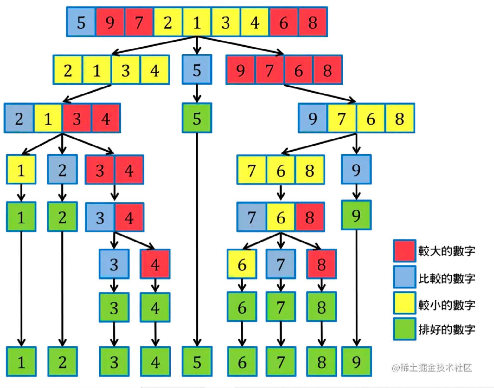

- 普通快排
  - 主要就是注意快排中的临界条件

```JS
// 基准选的是第一个
function QuickSort(arr) {
  if (!arr || arr.length < 2) return arr;
  const partition = (arr, L, R) => {
    if (L >= R) return;
    const pivot = arr[L];
    let l = L;
    let r = R;
    while (l < r) {
      // 时时刻刻要看 l < r
      while (l < r && arr[r] >= pivot) {
        r--;
      }
      while (l < r && arr[l] <= pivot) {
        l++;
      }
      // 只有 l != r 时才可以交换，当l = r时就要退出这一趟的parttion了
      if (l != r) {
        swap(arr, l, r);
      }
    }
    // 一趟快排结束前要把基准值放到这趟排序的中间形成 [less, pivot, more]
    if (L != l) {
      // L == l 说明只剩基准值了
      swap(arr, L, l);
    }
    return l;
  };
  const quick = (arr, L, R) => {
    if (L < R) {
      const index = partition(arr, L, R);
      quick(arr, L, index - 1);
      quick(arr, index + 1, R);
    }
  };
  quick(arr, 0, arr.length - 1);
  return arr;
}
```

- **随机快排（快排优化）**

- 添加随机 pivot

```JS
    // 随机选择一个基准数 [L, R] [0, 5]
    const pivotIndex = Math.floor(Math.random() * (R - L + 1)) + L;
    // 切记不要跟自己交换
    if (pivotIndex != L) {
      swap(arr, pivotIndex, L);
    }
```

三. 选择排序
核心思想：每一趟（i）都选出表中最小（或者最大）的的数，将它放到 i 的位置。

1. 选择排序

- 核心思想：每一趟（i）都选出表中最小（或者最大）的的数，将它放到 i 的位置
- 代码

```JS
function SelectSort(arr) {
  if (!arr || arr.length < 2) {
    return arr;
  }

  for (let i = 0, len = arr.length; i < len; i++) {
    let minValueIndex = i;
    for (let j = i + 1; j < len; j++) {
      minValueIndex = arr[j] < arr[minValueIndex] ? j : minValueIndex;
    }
    // 如果最小值的下标发生变化，就交换
    if (minValueIndex !== i) {
      swap(arr, i, minValueIndex);
    }
  }
  return arr;
}
```

2. 堆排序

- 堆的定义：n 个元素的序列满足 Ki <= K2i && Ki <= K(2i + 1) [小根堆] 或 Ki >= K2i && Ki >= K(2i + 1) [大根堆]
  - 左子节点: 2 \* i + 1 右子节点： 2 \* i + 2 父节点： (i - 1) / 2
- 堆排序：输出堆顶元素，将剩余元素重新构造成堆。循环往复，输出所有的堆元素之后，就得到了堆排序。
- 堆排序主要就是两步操作：
  - 建堆：拿到一个元素，拿它
- 小根堆
- 大根堆

```js
function HeapSort(arr) {
  if (!arr || arr.length < 2) {
    return arr;
  }

  // 构造大根堆
  const buildHeap = (arr) => {
    for (let i = 0, len = arr.length; i < len; i++) {
      let index = i;
      // arr[i] 和 它的父节点(i-1) >> 1 作比较
      while (index > 0 && arr[index] > arr[Math.floor((index - 1) >> 1)]) {
        swap(arr, index, Math.floor((index - 1) >> 1));
        index = Math.floor((index - 1) >> 1);
      }
    }
  };

  const heapify = (arr, index, heapSize) => {
    let left = (index << 1) + 1;
    let root = index;
    while (left < heapSize) {
      let largest = left + 1 < heapSize && arr[left + 1] > arr[left] ? left + 1 : left;
      largest = arr[largest] > arr[root] ? largest : root;
      if (largest == root) break;
      swap(arr, largest, root);

      root = largest;
      left = (left << 1) + 1;
    }
  };
  // 1. 先将无序序列构造成堆
  buildHeap(arr);

  let heapSize = arr.length;

  while (heapSize > 1) {
    // 2. 交换堆顶和堆底的元素
    swap(arr, 0, --heapSize);
    // 3. 将剩下的元素重新调整为堆
    heapify(arr, 0, heapSize);
  }

  return arr;
}
```

- 堆排序的方法对记录数较少时并不推荐，堆排序的最坏时间复杂度也是 O(NlogN),但由于它的特性，其运行时间主要花费在建堆和调整堆时进行的反复“筛选”上。
- 时间复杂度：O(NlogN)、空间复杂度：O(1)

四. 归并排序
核心思想：分治，将大问题化小，先解决小问题，再合并成大问题。将两个或两个以上的有序表组合成一个新的有序表的过程。

1. 归并排序

五. 计数排序
核心思想：从头到尾统计每个记录出现的次数（新建一个和原始表（OrginData）长度一致的空表，OrginData[i] 出现 1 次，就在 newData[OrginData[i]]的位置加 1 记录次数），最后遍历新表，取出每个次数对应数组存放到结构中（每个次数对应的都是某个值出现的次数），就形成了有序表。
适用范围：**适用原表中最大值和最小值之间相差不大，分布均匀，否则新开辟的数组空间太大就造成空间浪费。无法适用于小数，只适合于正数类型场景。**

1. 计数排序

- 代码

```js
function CountSort(arr) {
  if (!arr || arr.length < 2) {
    return arr;
  }
  // 找出最大值, 以便确定创建多少的桶
  const len = arr.length;
  let arrMaxVal = arr[len - 1];
  for (let i = 0; i < len; i++) {
    arrMaxVal = arr[i] > arrMaxVal ? arr[i] : arrMaxVal;
  }

  const bucketArrLen = arrMaxVal + 1;
  const bucketArr = new Array(bucketArrLen).fill(0);

  // 计数
  for (let i = 0; i < len; i++) {
    bucketArr[arr[i]] += 1;
  }

  // 取出每个'桶'里的数
  let sortedIndex = 0;
  for (let i = 0; i < bucketArrLen; i++) {
    while (bucketArr[i]-- > 0) {
      arr[sortedIndex++] = i;
    }
  }
  return arr;
}
```

- 时间复杂度： O(n + k) 、空间复杂度：O(n + k) k: 桶的个数

2. 桶排序

- 核心思想：
  - 1. 利用映射关系，将元素存于有限个桶内。
  - 2. 桶内元素利用某种排序方式进行排序
  - 3. 最后遍历每个桶就得到了排序后的元素。
- 时间复杂度：依赖桶内采取的排序算法的时间复杂度，

六. 基数排序
核心思想：将表中的数据按位进行分配和收集。有 MSD（从高位开始）和 LSD（从低位开始）两种不同的策略。
在算法过程中，对于 LSD，对某个有效数位分配后需要执行一次合并，然后再对下一位分配；而对于 MSD，对某个有效数位分配后不执行合并，它将继续对相同高位的元素继续进行分配，直到无法继续分配时执行合并操作。

1. 基数排序
   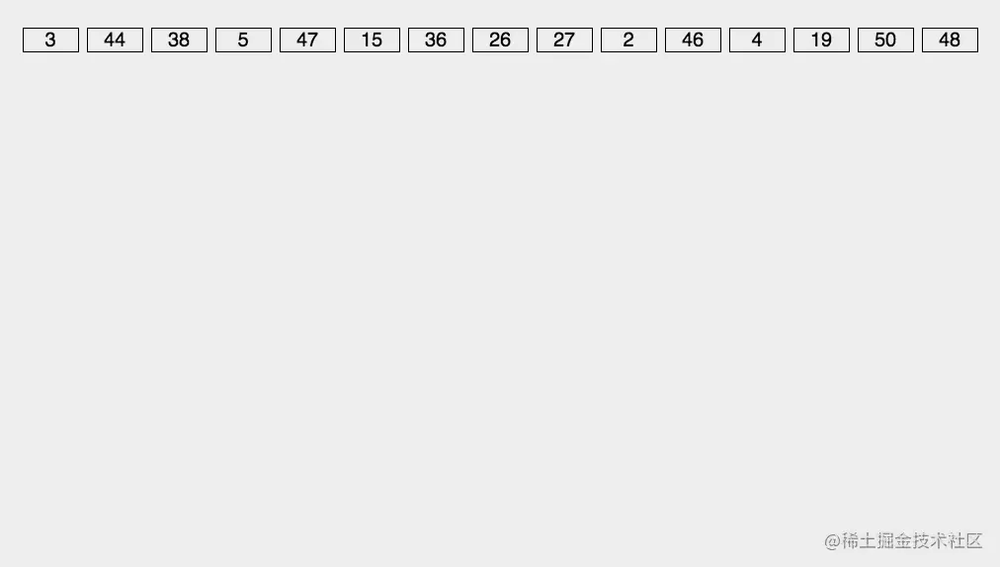

### 必备数据结构

一. 线性结构
逻辑上的线性

1. 数组
   JS 中的数组和其它语言的数组不太一样，JS 中的数组是一个可以动态修改的对象，增加一个元素，它会动态增长。
   JS 中的数组索引是字符串类型，并不像其它语言一样是数字，因为 JS 中的对象属性名要求是字符串。

- JS 数组为什么可以保存不同类型？
  JSArray 继承自 JSObject,所以在 js 中，数组是一个特殊的对象，内部也是以 key-value 形式存储数据，所以 js 中数组可以存储不同类型的值。
- js 数组是如何存储的？
  快数组: 默认方式
  慢数组：当数组长度增加到一定量会自动降级为慢数组，它不需要开辟连续的存储空间，但是需要额外维护一个 HashTable，与快数组相比，性能较差。
- js 数组的动态扩容和减容？

  - 扩容：
    - push 时发现内存不足
    - 申请 old_capacity + (old_capacity>>1) + 16 长度的内容空间
    - 将数组拷贝到新内存中
    - 把新元素放到当前 length 的位置
    - 数组 length + 1
    - 返回 length
  - 减容：
    - pop 时，获取数组 length
    - 获取 length-1 上的元素
    - 数组 length - 1
    - 判断数组的总容量是否 >= 2\* (length -1)
      - 是的话，计算要释放空间，做好标记、等待 gc 回收
      - 不是的话，用 holes 对象填充
    - 返回要删除的元素

- 可以通过 Array.isArray()判断一个对象是否是一个数组
- 数组的常用方法：
  - 开头和结尾处插入
    - push 末尾插入
    - unshift 头部插入
  - 开头和结尾处删除
    - pop 末尾删除
    - shift 头部删除
  - 任意位置插入和删除
    - splice(index, 要删除的个数，要添加的参数)
      - e.g: arr.splice[3, 1, 2,3,5,6] 表示 arr 索引 3 的位置开始删除 1 个元素，并把 2，3，5，6 加到删除的元素后
    - 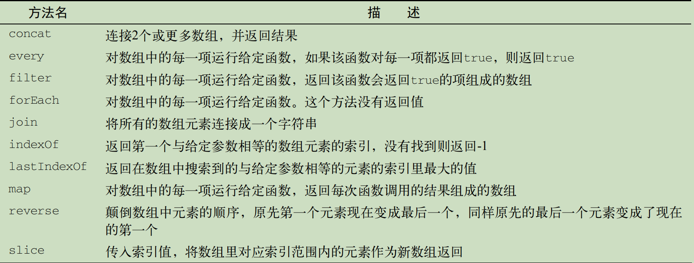
      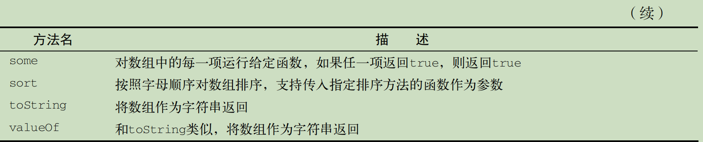

1. 栈
   栈常见的应用有：进制转换、括号匹配、栈混洗、中缀表达式、后缀表达式（逆波兰表达式）
2. 队列
   优先队列 & 循环队列 & 双向队列
   - 优先队列：就是在插入的时候比较 queueItem 的 priority 优先级，遍历队列将带排元素插到大于他优先级的元素前（按优先级数小在前）;其余操作和普通队列一样
   - 循环队列：就是将出队的元素重新由入队; 比如 LRU 策略就可以利用循环队列来实现
   - 双向队列：就是可以在队列的两端进行插入和删除，个人感觉好像就是个数组了

**JS 中常用数组来表示栈和队列两种数据结构，其实栈和队列就是操作受限的数组**

4. 链表
   双向链表 & 循环链表 & 双向循环链表
   链表类型掌握四点：
   - 一个原则：画图，链表题画图，明确指针的指向；链表天生具备递归性，所以不必画出完整的链表图，仅画出一个子结构就可以。
   - 两个考点：
     - 指针修改
     - 链表拼接
   - 三个注意：
     - 环：链表出现环，有两种可能，① 其本身就带有环 ② 由于误操作，导致出现了环，要避免出现环，解决办法就是画图明确指针指向。
     - 边界
     - 前后序
   - 四个技巧： - 虚拟头 - 快慢指针 - 穿针引线 - 先穿后排再判空

二. 集合(Set)、字典(Map) & 散列表(hashMap)

- 散列表是非顺序结构

三. 树形

- 基础概念
- 类型

  - 二叉树
  - 二叉搜索树
  - 平衡二叉树
  - 红黑树

    - 理解红黑树，先认识 2-3-4 树

      - 2-3-4 树是一个四阶的 B 树
      - 所有叶子节点都拥有相同的深度
      - 2-节点：包含 1 个元素的节点，有 2 个子节点
      - 3-节点：包含 2 个元素的节点，有 3 个子节点
      - 4-节点：包含 3 个元素的节点，有 4 个子节点

        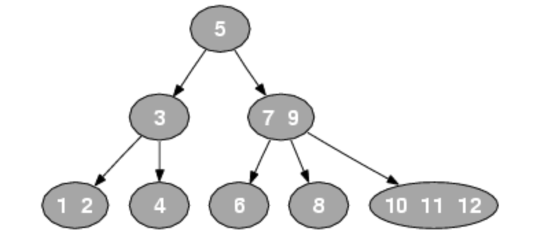
        至于为什么说红黑树是 2-3-4 树的一种等同呢？这是因为 2-3-4 树的每一个节点都对应红黑树的一种结构。

    - 2-3-4 树和红黑树的对应关系

      - 2-节点对应红黑树的一个黑色节点
        
      - 3-节点可以有两种红黑树节点，一种是右倾、一种是左倾，所以一个 2-3-4 树可以有多个红黑树
        
      - 4-节点转换的情况只有一种，中间节点黑色，左右节点红色
        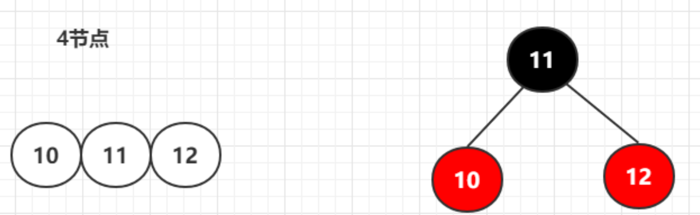
      - 2-3-4 树的裂变（当节点元素超过 3 个元素时就会发生裂变）转换红黑树
        

    - 2-3-4 树插入规则：

      - 插入都是最后一层插入
      - 升元：将插入节点由 2-节点升级成 3-节点、或由 3-节点升级成 4-节点
      - 向 4-节点插入元素后，需要将中间元素提到父节点，完成裂变；如果父节点也是 4-节点，则递归向上层升元，至到根节点

    - 2-3-4 树 删除操作

      - 自己能搞定的
      - 自己搞不定的
        - 跟兄弟节点借，兄弟不借，找父亲节点借，然后再找一个兄弟节点上去
      - 跟兄弟借，兄弟也没有

    - 红黑树：
      - 只有红黑两种节点
      - 根节点只能是黑色
      - 叶子节点（NIL）是黑色
      - 不能有相邻两个红节点
      - 每条边黑色节点相同
      - 新增节点是红色
    -

  - 完全二叉树

- 节点的深度： 取决于它祖先节点的个数。
- 树的高度：取决于所有节点深度的最大值。
- 树的遍历分两种
  - 深度优先(DFS)
    - 前序遍历
    - 中序遍历
    - 后序遍历
  - 广度优先(BFS)
    - 带层
    - 不带层

四. 图

1. 基本概念
   1. 相邻顶点：由一条边连接在一起的顶点称为相邻顶点
   2. 顶点的度: 顶点相邻顶点数
   3. 简单路径：要求不包含重复的顶点；环也是一个简单路径（ABCDA）
   4. 连通图: 图中每两个顶点间都存在路径
   5. 稀疏图：不是强连通的图
   6. 有向图和无向图、带权图和不带权图
2. 图的表示
   1. 邻接矩阵：每个顶点作横坐标和纵坐标建立的二维数组，以 1 表示顶点之间有连接，0 表示无连接;
      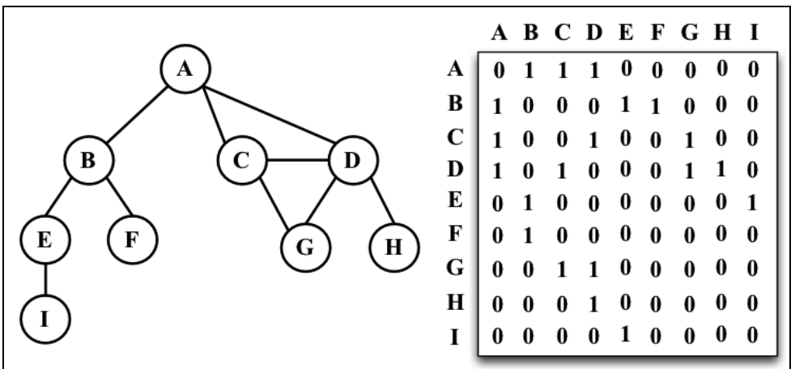
   2. 邻接表：由图中每个顶点的相邻顶点列表组成；
      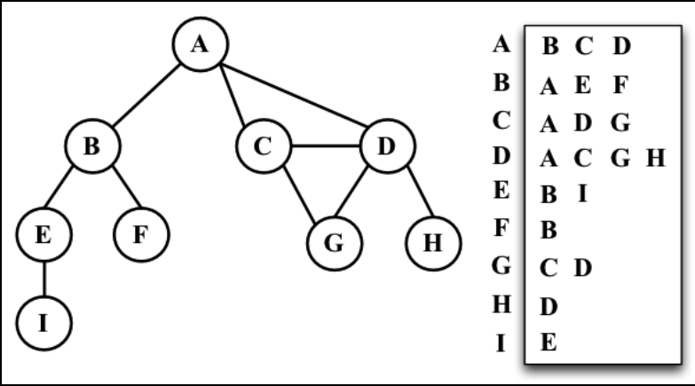
   3. 关联矩阵：行表示顶点，列表示边; 1 表示该顶点有该边，0 表示没有；关联矩阵通常用于边的数量比顶点多的情况，以节省空间和内存
      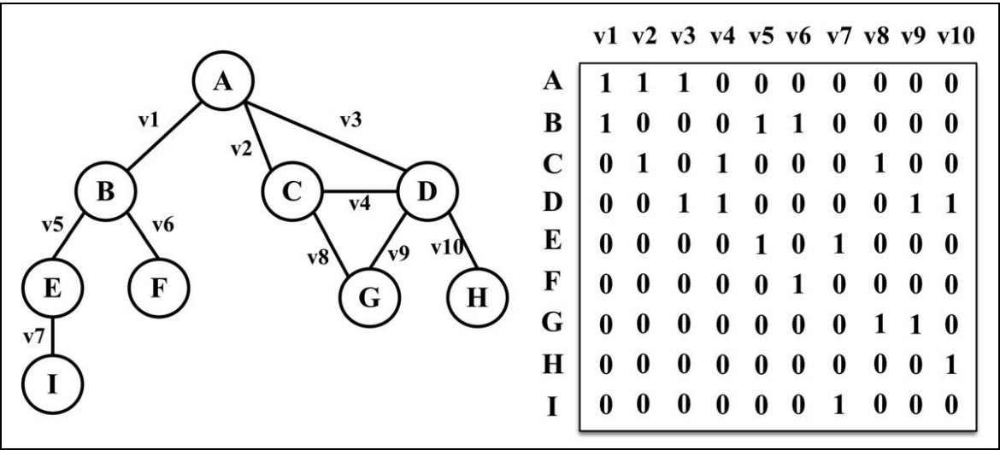
3. 图的遍历
   1. 深度优先搜索(DFS)
      1. 基于栈或递归，通过将顶点存入栈中，顶点是沿着路径被探索的，存在新的相邻顶点就去访问
   2. 广度优先搜索(BFS)
      1. 基于队列，入队列的顶点先被探索（核心思想：广度优先搜索依赖队列的先进先出）
      2. 会先从指定的第一个顶点开始遍历图，先访问其所有相邻顶点；
      3. 实现：
         1. 创建一个队列，入队第一个顶点
         2. 队列不为空，持续进行
            1. 顶点出队，并标记为被访问（颜色标记为灰色）；
            2. 将该顶点所有未被访问（颜色为白色的）相邻顶点入队；
            3. 将该顶点标记为完全访问(颜色标记为黑色)
4. 图的应用
   1. 最短路径算法
   2. 拓扑排序
   3. 找出入度，找每个事物（顶点）的关系（边、入度和出度，由这些反映顶点的信息）2022.8.10

### 位运算

<<
\>> 右移
\>>> 有符号右移

- 操作符
  &
  |
  ^
- 最佳实践
  - | 授权
  - & 鉴权
  - ^ 删除授权

### 算法思想

1.
