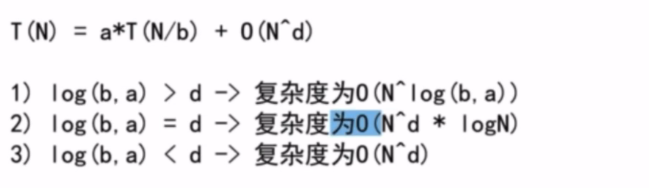

## 计划 2022.5.27 - 2022.6.27 （每天）

### 2 小时 3 道题， 平均一道题 40min

- 并不是连续刷题
- 前 10min 理解题意, 理解题意很重要，把握住题目的细节，做到不看题目心中知道题目表达的含义
- 20min 分析过程，最后 10min coding
- 额外再花点时间记录刷题过程 —— 简单总结，记录对这题的理解，分析时间复杂度、空间复杂度

### 刷题不能乱刷，每个 topic 都要有涉略，每个类型都要有

- 新手：
  - 数组
  - 字符串
  - 链表
  - 数学
  - 栈
  - 哈希表
  - 树
  - 图
- 进阶
  - 排序
  - 二分
  - 递归
  - 双指针
  - 贪心
  - 深度优先
  - 滑动窗口
  - 动态规划

### 用一个 EXCEL 表记录刷题记录

### 程序 = 数据结构 + 算法

1. 数据结构也比较重要

### 必备的类型有：


### 学习的一个顺序

算法考题中会涉及到很多的知识点，纯算法的，数据结构的，数学的，脑筋急转弯的...
我们的目的不去去完成所有的算法题，只掌握基础的  
算法 + 数据结构  
后面有基础，对刷题有感觉了再去做高频的且自己不会的

### 先看左神算法课的笔记，看不懂的地方再去搜视频

### 语言 JavaScript 和 java

### 时间复杂度

- 常数操作数量
  - \+ - \* / % 数组寻址
- 等差数列 0 + 1 + 2 + 3 + 4 + ... + n-1

### 评价一个算法的好坏就是看它的 Time/Space 复杂度

- 单从时间复杂度来看，我们就是要追求时间复杂度低的算法，简单来说就是减少一个算法中数据操作量，常数操作的减少意义不大，要减少指标量级的。

### 对数器

1. 有一个想要验证的方法 a
2. 实现一个绝对正确但并不怎么好的方法 b
3. 实现一个随机生成随机数组的方法
4. 测试大量数据比对方法 a 和方法 b
5. 如果有错记录出错时状态
6. 如果大量数据比对都没有没问题，方法 a 就正确

### 基础的纯算法的有

1. 扫描线
2. BFS
3. DFS
4. 二分搜索
5. 分治法
6. 单调栈
7. 单调队列
8. 滑动窗口
9. 十大排序

- 冒泡排序
- 选择排序
- 插入排序
- 归并排序
- 随机快排
- 堆排序
- 桶排序
- 计数排序
- 基数排序

### 递归 ---- 分治思想，大问题化小

- 剖析递归时间复杂度
  - master 公式：
    - 
    - a 是大问题递归次数之间的关系（不是子问题一共发生次数，a 是一次大问题化子问题化了几次），N/b 是子问题的数据量规模，后面加的是除去递归之后剩下操作的一个时间复杂度
  - master 公式适用范围是划分的子问题规模是一样的，不一样就不能套用 maste 公式
- 例子
  - 求最大值
  - 归并排序(O(N\*logN))
    - 左边排序、右边排序
    - 再把左右两边 merge
  - 小和问题：在一个数组中，每一个数左边比当前数小的数累加起来，叫做这个数组的小和。求一个数组的小和。
    - 例[1, 3, 4, 2, 5]
    - 1 + 1 + 3 + 1 + 1 + 3 + 4 + 2 = 16
    - merge 的时候，找到右侧数组中 比 cur 数大的次数 t，形成 t \* cur 小和
    - 每次 merge 的时候，就会逐渐找出小和
    - 用分治的思想去解决小和问题，就可以在一次 merge 的时候批量找出右边比当前数大的次数
      - res += arr[p1] < arr[p2] ? (R - p2 + 1) \* arr[p1] : 0;
      - 大问题是在数组中找左边比当前数小的数相加
        - 子问题变成 在左边当前数，找右边数中比当前数大的数有几个
        - 分治思想分治很简单，分治的过程只是将大问题无限化小，化成只有左和有两部分
        - 在最后的 merge 才是问题的实际解决过程
  - 逆序对问题：一个数组中，左边的数如果比右边的数大，则这两个数构成一个逆序对，请打印所有逆序对
    - 分治之后判断右边数种比当前数小
  - 归并排序快的原因是它组内的排序行为没有被浪费，在最后 merge 利用外排的方式把之前有序的排序利用起来。不像冒泡，选择、插入排序那样，它们慢的原因就是在于有重复的比较行为。

### 二分法

- 二分法 while 的写法

1.  ```Java
    while(l < r) {
      ...
    }
    return sortedArr[L] == target;
    ```
2.  ```Java
    while(l <= r) {
      ...
    }
    return false;
    ```
3.  二分法还要注意 mid:

- (L+ R)/2 这种写法会有溢出的可能性
- 推荐写法是 L + (R - L)/2)这种写法保险, 还可以写成 L + ((R-L)>>1)

4. 二分法适用范围

- 数据集是有序的
- 数据集在有限范围内是有序的（比如求 局部最小值，只有数据在局部是有序的就可以用二分法）

### 快排

- 荷兰国旗问题
- 经典快排的思想跟荷兰国旗问题差不多，拿最后一个数 X 划分，左边小于等于 X，右边大于 X
  - 经典快排每次只处理一个数
  - 经典快排和数据状态有关：
    - 如果数组有序，快排每次就只处理了一个数，左边是小于 X，右边没有，这样一次是 O(N),要循环 N 次，快排就退变成 O(N²)
    - 如果数组每次划分比较好，中间数永远在中间，那就是 O(N\*logN)
  - 优化：添加随机，替换最后一个位置数 X，快排就变成长期期望是 O(N\*logN)的算法
  - 随机快排是三个 O(N \* logN)算法中最快的算法，当最高指数项一致时，比较常数项；快排常数操作小
  - 随机快排的额外空间复杂度长期期望是 O(logN)，空间浪费在记录 P 的边界， 每次 partition 都会记录 p

### 递归 系统栈的代价是比较大的，工程上不允许出现递归

- 系统压栈会把递归所有的信息都记录下来，这个代价是比较大的
- 而且系统栈在递归了一定范围是会报错
- 递归函数一定是要改成非递归

### 绕开源数据数据状况最常用的两种操作：

1. 随机打乱数据状况
2. hashMap

### 堆排序

- 堆结构(优先级队列) —— 完全二叉树
  - 数组结构 2\*i + 1 就可以对应出一个二叉树，完全以数值之间的关系补全二叉树
- 大根堆（任何一棵子树的 root 都是最大值）
  - i 找它的父节点（(i - 1)>>1），判断大小交换
  - 每一步都形成大根堆，直至换完整个数组
  - 交换的代价与完全二叉树的高度有关，O(logN)
  - 建立大根堆的时间是 O(N) = log1 + log2 + log3 + ... + logN-1 ——heapInsert
  - 堆向下跑 —— heapify
- 小根堆（任何一棵子树的 root 都是最小值）
- 堆的调整（不管是加一个数，减一个数）都是 logN 的

- 堆排序
  - 1. 形成一个大根堆
  - 2. 每次堆顶和堆低交换，heapSize-1
  - 3. 再经历一个 heapify 的过程形成一个长度减一的大根堆，再循环步骤 2、3
  - 每次 2 后最大的数就被放到了末位，这样再经过 3 的循环，逐渐排完整个数组

### 视频 2 最后的补充问题

- 给定一个数组，求如果排序之后，相邻两数的最大差值，要求时间复杂度 O(N)，且不能用非基于比较的排序。
