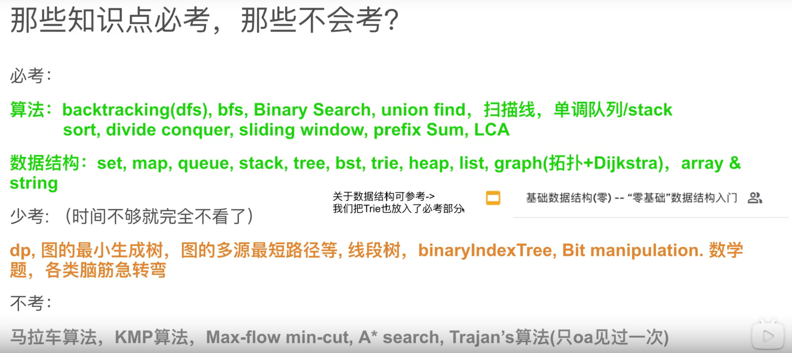

## 计划 2022.5.27 - 2022.6.27 （每天）

### 2 小时 3 道题， 平均一道题 40min

- 并不是连续刷题
- 前 10min 理解题意，20min 分析过程，最后 10min coding
- 额外再花点时间记录刷题过程 —— 简单总结，记录对这题的理解，分析时间复杂度、空间复杂度

### 刷题不能乱刷，每个 topic 都要有涉略，每个类型都要有

### 用一个 EXCEL 表记录刷题记录

### 程序 = 数据结构 + 算法

1. 数据结构也比较重要

### 必备的类型有：



### 学习的一个顺序

算法考题中会涉及到很多的知识点，纯算法的，数据结构的，数学的，脑筋急转弯的...
我们的目的不去去完成所有的算法题，只掌握基础的  
算法 + 数据结构  
后面有基础，对刷题有感觉了再去做高频的且自己不会的

### 先看左神算法课的笔记，看不懂的地方再去搜视频

### 语言 JavaScript 和 java

### 时间复杂度

- 常数操作数量
  - \+ - \* / % 数组寻址
- 等差数列 0 + 1 + 2 + 3 + 4 + ... + n-1

### 评价一个算法的好坏就是看它的 Time/Space 复杂度

- 单从时间复杂度来看，我们就是要追求时间复杂度低的算法，简单来说就是减少一个算法中数据操作量，常数操作的减少意义不大，要减少指标量级的。

### 对数器

1. 有一个想要验证的方法 a
2. 实现一个绝对正确但并不怎么好的方法 b
3. 实现一个随机生成随机数组的方法
4. 测试大量数据比对方法 a 和方法 b
5. 如果有错记录出错时状态
6. 如果大量数据比对都没有没问题，方法 a 就正确

### 基础的纯算法的有

1. 扫描线
2. BFS
3. DFS
4. 二分搜索
5. 分治法
6. 单调栈
7. 单调队列
8. 滑动窗口
9. 十大排序

- 冒泡排序
- 选择排序
- 插入排序

### 二分法

- 二分法 while 的写法

1.  ```Java
    while(l < r) {
      ...
    }
    return sortedArr[L] == target;
    ```
2.  ```Java
    while(l <= r) {
      ...
    }
    return false;
    ```
3.  二分法还要注意 mid:

- (L+ R)/2 这种写法会有溢出的可能性
- 推荐写法是 L + (R - L)/2)这种写法保险, 还可以写成 L + ((R-L)>>1)
